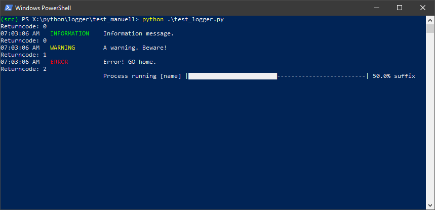

# cli_logger
Easy logger for python command line programs using click.
## What it does
Use this script in your programs to get pretty-printed messages printed to STDOUT. To see what it does, just execute the script in test_manuell (which does not contain a unit test, but a script to see what it does.

Here's a screenshot:


It comes with these features:
* Setting a severity level, to hide non-relevant / verbouse output.
* Printing text at level Debug, Information, Warning and Error.
* Retrieve a return code in case a warning (1) or an error (2) has been raised.
* Configurable progress bar.

# How to use

## Program initialisation
At program initialisation, use ```set_minimum_severity_level``` to decide from which level and above messages should be printed.

| Level | Rank | ```MessageClass=``` | Description |
| ----- | ---- | ------------------- | ----------- |
| 1 | Lowest | ```DEBUG``` | Information helping to understand the program flow or to search for errors. Of course, developers might use debuggers, but consider a productive use where debugging is not possible. |
| 2 | | ```INFORMATION``` | Default level. Information to the user that does not require to intervent. |
| 3 | | ```WARNING``` | Hint that something hasn't been as expected. Results might be erreneous. |
| 4 | Highest | ```ERROR``` | Something went wrong and it wasn't possible to resolve the situation. |

## Program execution
### Print to the screeneee

Use ```debug('my message')```, ```information('my message')```, ```warning``` and ```error``` to create output.
log, information, set_minimum_severity_level, error, debug, warning, returnCode, 

### Print a progress bar 
```printProgressBar```

## Program termination
Retrieve a return code ```returnCode()``` which indicates if a warning or error has been issued. For sure, a discussion could be opened wether this is a good method or wether exceptions would suit better.

Rules to create a return code (last verified rule wins):
| Event | Return Code |
| ----- | ----------- |
| Only messages of type ```DEBUG``` or ```INFORMATION``` have been issued. | ```0``` |
| At least one ```WARNING``` has been issued. | ```1``` |
| At least one ```ERROR``` has been issued. | ```2``` |
